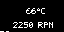

# go-anime-matrix-io


This project, `go-anime-matrix-io`, is a Go-based utility that fetches system performance data (CPU temperature and fan speeds) and displays it on an ASUS Anime Matrix display. It works by retrieving system sensor data at regular intervals, and generates a GIF that is displayed on the Anime Matrix display. This utility has been tested to work on systems running ASUS hardware with an Anime Matrix display and the `asusctl` utility installed.

## Getting Started

These instructions will get you a copy of the project up and running on your local machine for development and testing purposes.

### Prerequisites

In order to run this project, you must have the following installed:

- Go (version 1.16 or later)
- ASUS system with Anime Matrix display
- `asusctl` utility from [asus-linux.org](https://asus-linux.org/)
- `lm-sensors` utility

You can install `asusctl` and `lm-sensors` using the package manager for your system. For Ubuntu-based systems, you would use:

```sh
sudo apt install lm-sensors
```

`asusctl` was installed on my Ubuntu machine while following their build instructions. You can find the instructions for installing `asusctl` on their [GitLab page](https://gitlab.com/asus-linux/asusctl#building)

### Installing

To get a copy of this project, you can clone it from GitHub using the following command:

```sh
git clone https://github.com/jackbillstrom/go-anime-matrix-io.git
```

After cloning the project, navigate into the project directory:

```sh
cd go-anime-matrix-io
```

You can then build the project using Go:

```sh
go build
```

### Usage

Once you have built the project, you can run it using:

```sh
./go-anime-matrix-io
```

**To install as a service, you might need to run the program as root.**

In some cases, you'd need to run the commands below in order to run as it as a service:

```sh
sudo systemctl daemon-reload && sudo systemctl restart anime-matrix-io.service
```

When the program is running, it will update the Anime Matrix display with the system's CPU temperature and fan speed every 10 seconds. The program runs indefinitely until it is stopped. To stop the program, you can use `Ctrl+C` in the terminal.

### What to do if the program crashes

The program is designed to handle crashes gracefully. If the program crashes or is forcefully terminated, it will automatically disable the anime matrix.

### TODO
- A TUI to change options graphically
- Better layout for the matrix display
- Better error handling
- Multiple themes
- Add options to customize the matrix display via a config file.
- Add support for other Anime Matrix displays
- Add support for other systems (Windows)
- Add support for other system sensors (GPU temperature, etc.)

## Contributing

We welcome contributions from the community. If you would like to contribute, please fork the repository and submit a pull request.

## License

This project is licensed under the MIT License - see the [LICENSE.md](LICENSE.md) file for details.

## Acknowledgments

Thank you to everyone who has contributed to the development and testing of this project. Your time and efforts are greatly appreciated.